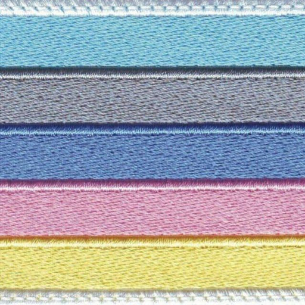
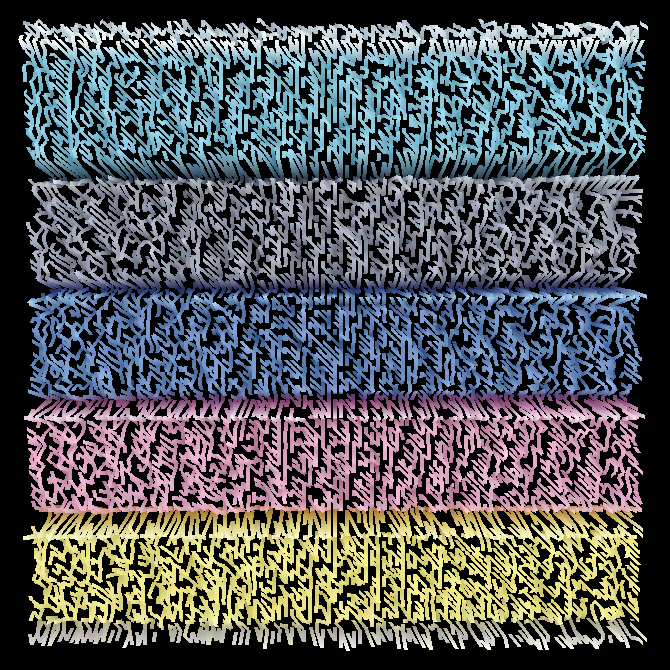
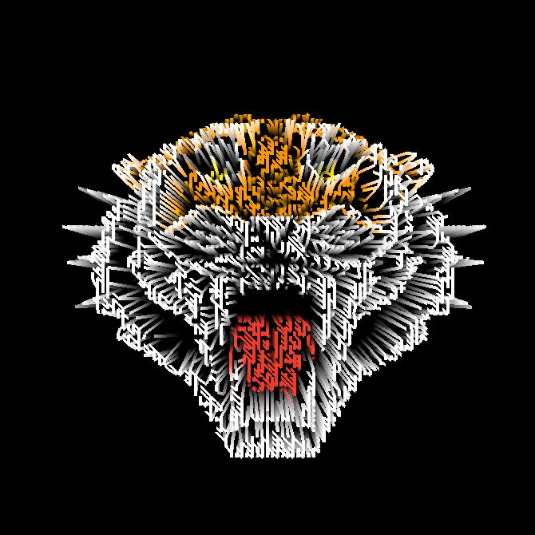
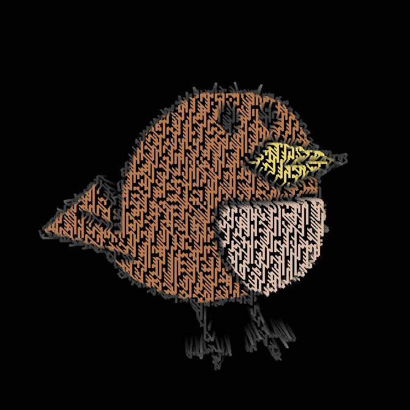
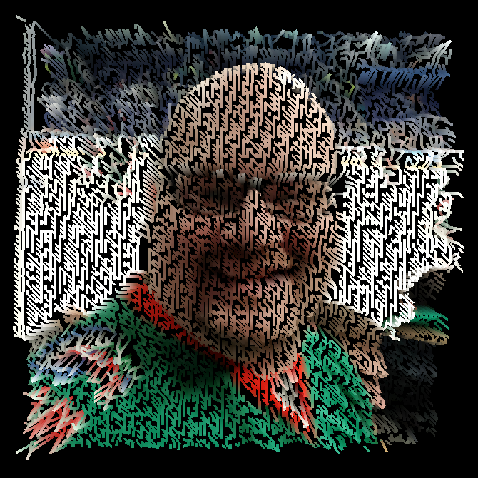

# Ava-day

[](https://sonarcloud.io/dashboard?id=RO-DIS_Ava-day)

## Application for avatar generation

   (day -> дай == give)


## Interface


## Sample outputs

   <details><summary><b><font color="#fa8e47">Spoiler</font></b></summary>
   <div id="column">
      <div id="row">
         
         
      </div>
      <div id="row">
         
         
      </div>
      <div id="row">
         
         
      </div>
      <div id="row">
         
         
      </div>
   </div>
   </details>

## Demo Video
* [Watch on YouTube](https://youtu.be/vjEz2ZzAJDE)

## Documentation

* All the documentation of the project is in the [Documentation folder](/Documentation)

## Installation

1. Open a terminal
   - Linux: `Ctrl+Alt+T`
   - Windows: `Win+X` -> Windows PowerShell (Admin) -> Press `Enter`
   - MacOS (not all screen models supported): `Cmd+Space` -> Type `terminal` -> Press `Enter`

1. Install `make`
   * Linux

      ```sh
      sudo apt-get install build-essential
      ```

   * Windows

      ```sh
      choco install make
      ```

   * MacOS

      ```sh
      brew install make
      ```

1. Navigate to Desktop via `cd`. You may also `cd` to another directory, of course.

   ```sh
   cd ~/Desktop
   ```

1. Clone the project there

   ```sh
   git clone https://github.com/RO-DIS/Ava-day
   ```

1. Navigate to the project root folder

   ```sh
   cd Ava-day
   ```

1. Run Makefile

   ```sh
   make run
   ```

## Using

2. Drag and drop an image into app window.

3. Do you see a big window with black background? Try to change the view with your mouse or touchpad!

   - Click and hold the left mouse button, then move the mouse to rotate the view.

   - You can also scroll to zoom in or out.

4. When you have found a cool view, click on `Save as` button to choose where to save your avatar.

5. Type some `name.png` or keep the name, choose a folder, and click on `Save`. Ta-da!

## Notes

1. As the default background for `.png` photos is black here, don't drop images like [this one](https://upload.wikimedia.org/wikipedia/ru/thumb/7/78/Trollface.svg/1200px-Trollface.svg.png)
