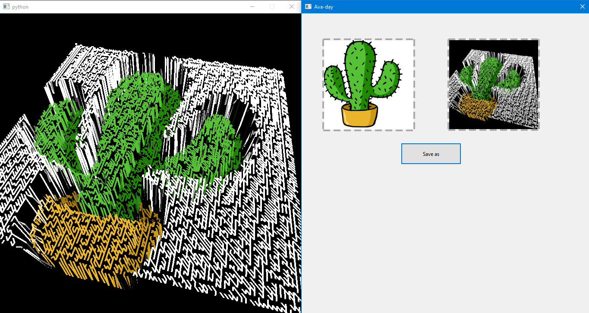

# Ava-day

[](https://sonarcloud.io/dashboard?id=RO-DIS_Ava-day)

## Application for avatar generation

   (day -> дай == give)


## Interface



## Sample outputs

   <details><summary><b><font color="#fa8e47">Spoiler</font></b></summary>
   <div id="column">
      <div id="row">
         
         
      </div>
      <div id="row">
         
         
      </div>
      <div id="row">
         
         
      </div>
      <div id="row">
         
         
      </div>
   </div>
   </details>

## Demo Video
* [Watch on YouTube](https://youtu.be/vjEz2ZzAJDE)

## Documentation

* All the documentation of the project is in the [Documentation folder](/Documentation)

## Installation

1. Open a terminal in some folder
   - Linux: `Ctrl+Alt+T` 
   - Windows: `Win+R` -> Type `cmd` -> Press `Enter`
   - MacOS (not all screen models supported): `Cmd+Space` -> Type `terminal` -> Press `Enter`

1. Clone the project

   ```sh
   git clone https://github.com/RO-DIS/Ava-day
   ```

1. Navigate to project root folder

   ```sh
   cd Ava-day
   ```

1. Create a new virtual environment

   ```sh
   python3 -m venv env
   ```
1. Activate it

   - On Linux/MacOS:
      ```sh
      source env/bin/activate
      ```
   - On Windows:
      ```sh
      env\Scripts\activate
      ```

1. Install all necessary packages, including [this application](https://stackoverflow.com/a/50194143).

    ```sh
    pip install -r requirements.txt
    ```

## Running

1. Run the application

    ```sh
    python main.py
    ```

2. Drag'n'drop an image into app window

3. Do you see a big window with black background? Try to change the view with your mouse or touchpad!

   - Click and hold the left mouse button, then move the mouse to change the view. 

   - You can also scroll your mouse wheel to zoom in or out.

4. When you have found a cool view, click on `Save as` button to choose where to save your avatar.

5. Type some `name.png`, choose a folder, and click on `Save`. Ta-da!

## Notes

1. As the default background for `.png` photos is black here, don't drop images like [this one](https://upload.wikimedia.org/wikipedia/ru/thumb/7/78/Trollface.svg/1200px-Trollface.svg.png)
